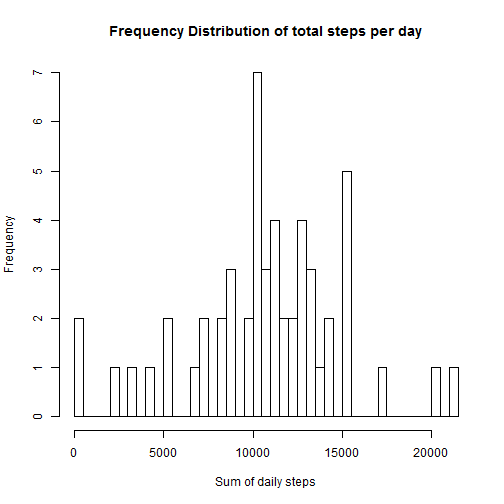
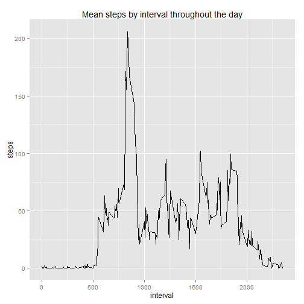
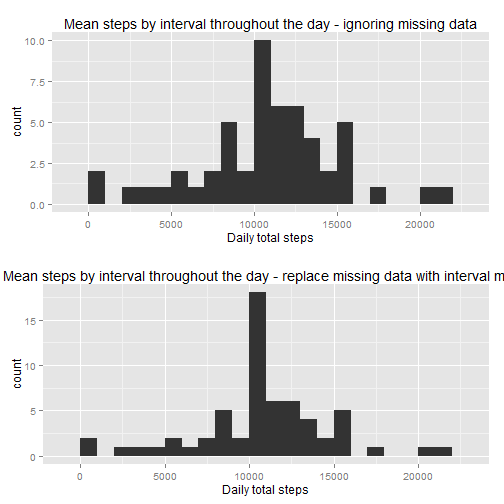
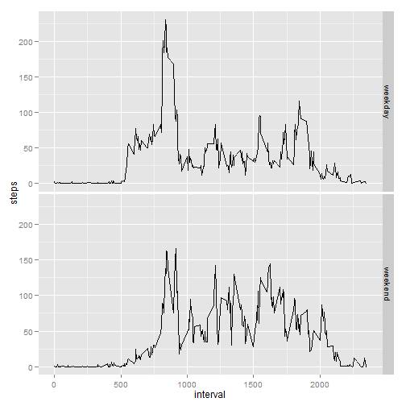

# Reproducible Research: Peer Assessment 1
The data in this project was collected by an activity monitoring device that counted steps in 5 minute increments over two months. More information about the data can be found at [README.md].


## Loading and preprocessing the data
The data is online in a zip file. These commands download the data into a temporary file, unzip it and load the data into a data frame *data*. This data frame is held in memory and copied to new variables at each step.

```r
if(!file.exists("activity.zip")){
        print("download")
        download.file("http://d396qusza40orc.cloudfront.net/repdata%2Fdata%2Factivity.zip",destfile="activity.zip")
}
data<-read.csv(unz("activity.zip","activity.csv"),colClasses=c("numeric", "Date", "numeric"))
```

Because we ignore the missing data in the first analyses I created a new datafile with all missing values removed (stepscomplete).


```r
stepscomplete<-data[!is.na(data$steps),]
summary(stepscomplete)
```

```
##      steps            date               interval   
##  Min.   :  0.0   Min.   :2012-10-02   Min.   :   0  
##  1st Qu.:  0.0   1st Qu.:2012-10-16   1st Qu.: 589  
##  Median :  0.0   Median :2012-10-29   Median :1178  
##  Mean   : 37.4   Mean   :2012-10-30   Mean   :1178  
##  3rd Qu.: 12.0   3rd Qu.:2012-11-16   3rd Qu.:1766  
##  Max.   :806.0   Max.   :2012-11-29   Max.   :2355
```


## What is mean total number of steps taken per day?
To examine the number of steps taken on each day, I:

  *  aggregated the data by date 
  *  renamed the columns in the resulting dataframe
  *  calculated the mean and median and  
  *  plotted a histogram:


```r
library(ggplot2)
stepsum<-aggregate(stepscomplete$steps, by=list(stepscomplete$date), FUN="sum")
names(stepsum)<-c("date","sumsteps")

nona.meansteps<-mean(stepsum$sumsteps)
nona.mediansteps<-median(stepsum$sumsteps)

hist(stepsum$sumsteps,breaks=75, xlab="Sum of daily steps",main="Frequency Distribution of total steps per day")
```

 


**The mean steps per day was 1.0766 &times; 10<sup>4</sup> and the median was 1.0765 &times; 10<sup>4</sup>.**


## What is the average daily activity pattern?
To view the daily pattern of activity I copied the original data, aggregated it by interval label and added labels.

```r
by5min<-data
by5minagg<-aggregate(by5min$steps,by=list(by5min$interval),FUN="mean",na.action=NULL, na.rm=TRUE)
names(by5minagg)<-c("interval","steps")
head(by5minagg)
```

```
##   interval   steps
## 1        0 1.71698
## 2        5 0.33962
## 3       10 0.13208
## 4       15 0.15094
## 5       20 0.07547
## 6       25 2.09434
```

Then I plotted a graph of activity through the day


```r
qplot(x=interval,y=steps,data=by5minagg,stat="identity",geom="line",main="Mean steps by interval throughout the day")
```

 

```r
moststepinterval<-by5minagg[by5minagg$steps==max(by5minagg$steps),"interval"]
```

**The most steps were taken during interval 835**

## Imputing missing values
In order to impute missing values I substituted any missing values with the mean activity for that time of day - for example, if there were a missing value at 8:15 am, I replaced it with the mean activity for that interval across the dataset. 

Again, I copied the original data into a new data frame from *data* and merged it with the interval averages so that each row has both the actual and average value for that interval. Then I created a new column that uses the original value if it is not NA, or the mean value if it is. This table was  extracted into *imputeddata* for aggregation.


```r
are.na<-sum(is.na(data$steps)==TRUE)

idata<-data
joined<-merge(idata,by5minagg,by.x="interval",by.y="interval", all=TRUE)
joined$steps<-ifelse(is.na(joined$steps.x),joined$steps.y,joined$steps.x)
imputeddata<-joined[,c("steps","date","interval")]
```

There were 2304 NA values in steps column of the original data.

Now to compare this data with the original as far as total steps per day. We already have daily step totals in *stepsum* (above) which was made ignoring any missing data. Now make another data frame in the same way from the imputed data.


```r
imputedstepsum<-aggregate(imputeddata$steps, by=list(imputeddata$date), FUN="sum")
names(imputedstepsum)<-c("date","sumsteps")
```
We can plot the two together and calculate mean and median as before:

```r
library(gridExtra)
plot.ignore.na<-ggplot(stepsum, aes(x=sumsteps))+geom_histogram(binwidth=1000)+labs(title="Mean steps by interval throughout the day - ignoring missing data")+labs(x="Daily total steps")
plot.impute.na<-ggplot(imputedstepsum, aes(x=sumsteps))+geom_histogram(binwidth=1000)+labs(title="Mean steps by interval throughout the day - replace missing data with interval mean")+labs(x="Daily total steps")


grid.arrange(plot.ignore.na,plot.impute.na,ncol=1)
```

 

```r
impna.meansteps<-mean(stepsum$sumsteps)
impna.mediansteps<-median(stepsum$sumsteps)
```

The mean (1.0766 &times; 10<sup>4</sup>) and median (1.0765 &times; 10<sup>4</sup>) were the same as in the original data and the histogram is a similar shape. However there are more occurences of the mean total of steps. 

## Are there differences in activity patterns between weekdays and weekends?
To compare weekend and weekday activity I added a column as a facet (weekend/weekday) and aggregated the data on it to plot side by side graphs. As you can see, activity starts earlier, peaks at about 9am and drops to almost nothing at 8pm on weekdays and is more spread across the day at the weekend.
require(lubridate)


```r
require(lubridate)
imputeddata$weekend<-ifelse(wday(imputeddata$date) %in% c(1,7),"weekend","weekday")


imputedby5minagg<-aggregate(imputeddata$steps,by=list(imputeddata$interval,imputeddata$weekend),FUN="mean",na.action=NULL, na.rm=TRUE)
names(imputedby5minagg)<-c("interval","weekend","steps")
imputedby5minagg$weekend<-factor(imputedby5minagg$weekend)

qplot(interval,steps,data=imputedby5minagg,facets=weekend ~ ., geom="line")
```

 
